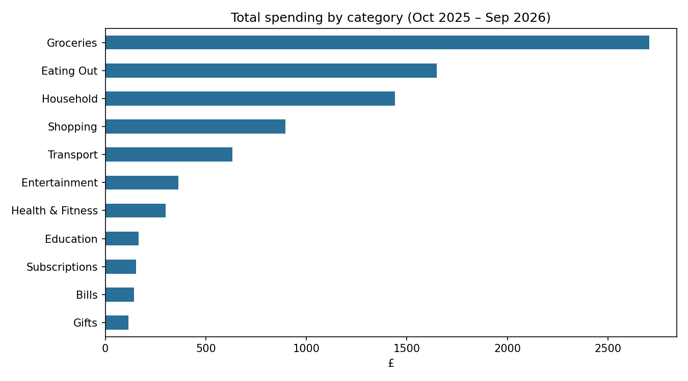
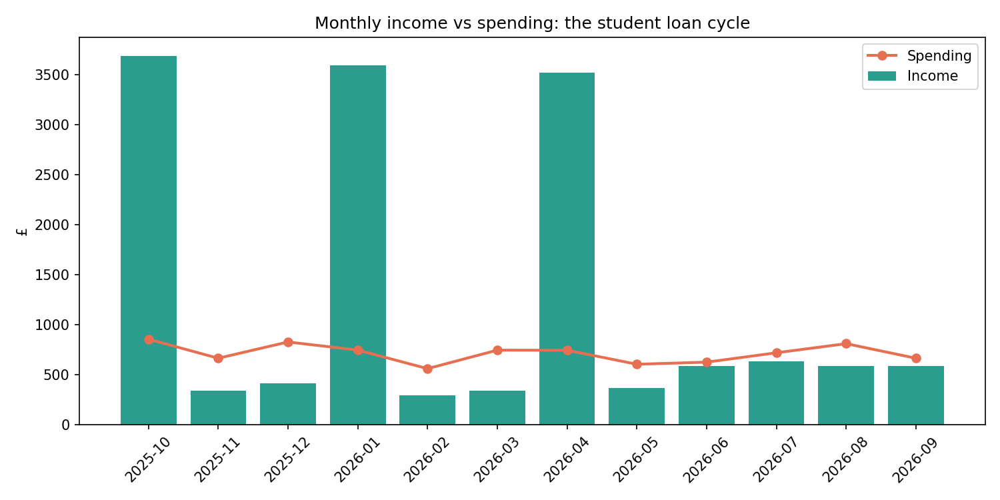

# Personal Finance Analysis

Analysis of a **simulated** 12-month student transaction dataset (Oct 2025 – Sep 2026) using Python and pandas. The project covers data cleaning, cash-flow analysis, variance decomposition, stress testing and forecast evaluation.

> **About the data:** the dataset is simulated. It was generated from rules designed to resemble a UK student's finances (termly loan payments, part-time wages with more summer hours, a Christmas spending spike). Some patterns reported below therefore exist **by construction**. All findings describe this simulated dataset only and should not be read as conclusions about real UK students. The aim of the project is to demonstrate the analytical methods.

## Questions

1. Where does the money go, and how does cash flow move through the year?
2. How much cash is needed to avoid running out between loan payments?
3. Which categories explain the largest month-to-month changes in spending?
4. How sensitive is the cash balance to reduced work hours or unexpected expenses?
5. Can a simple forecast of weekly spending be defended against held-out data?

## Data cleaning

The raw data (543 transactions) contained several quality issues:

| Issue | How it was handled |
|---|---|
| 8 duplicate rows | Removed |
| Inconsistent category labels (e.g. "food", "FOOD ", "Food") | Stripped whitespace and standardised capitalisation |
| 12 missing categories | Filled using the most common category for the same merchant |
| Amounts stored as text, some with "£" signs | Stripped symbols and converted to numbers |
| 4 missing amounts | Removed, as they couldn't be reliably estimated |
| Mixed date formats | Parsed to a single datetime format (UK day-first) |

The final clean dataset has 531 transactions.

## Findings (within the simulated dataset)

### 1. Spending and cash flow
- Groceries (31.6%) and eating out (19.3%) make up about 51% of spending.
- Total income was £14,955 against £8,565 of spending.
- The three months with a Student Finance payment (Oct, Jan, Apr) each show a surplus of roughly £2,800; the other 9 months all run at a deficit of between £39 and £412.

### 2. Cash needed between loan payments
For each loan cycle, the running balance of wages minus spending was tracked day by day (excluding the loan). Its lowest point is the cash the loan must cover. Daily tracking was used because monthly totals can hide mid-month dips.

| Cycle starts | Days | Loan (£) | Cash needed to bridge (£) | Tightest day | Headroom left (£) |
|---|---|---|---|---|---|
| 1 Oct 2025 | 103 | 3,300 | 1,527 | 8 Jan 2026 | 1,773 |
| 12 Jan 2026 | 98 | 3,300 | 1,221 | 16 Apr 2026 | 2,079 |
| 20 Apr 2026 | 164 | 3,300 | 1,021 | 3 Sep 2026 | 2,279 |

The autumn cycle is the tightest, as Christmas spending falls at its end. The summer cycle is the longest but needs the least, because of higher summer wages.

### 3. What drives month-to-month changes
Each category's share of the variance in total month-to-month spending change (covariance with the total change ÷ variance of the total change):

| Category | Share of variation |
|---|---|
| Shopping | 42.9% |
| Gifts | 14.5% |
| Transport | 12.2% |
| Groceries | 10.8% |
| Entertainment | 7.3% |
| Eating Out | 6.8% |
| Education | 6.1% |
| Bills, Health & Fitness, Household | 0.0% |
| Subscriptions | −0.7% |

The largest category (groceries) explains little of the variation because it is steady; irregular purchases (shopping, gifts) drive the swings. Based on only 11 monthly changes, so the exact shares are approximate.

### 4. Stress test
Lowest balance over the year (£), starting from £0 on 1 October, with the shock assumed to hit before the tightest day (worst case):

| | Shock £0 | Shock £250 | Shock £500 | Shock £1,000 |
|---|---|---|---|---|
| Wages 100% | 1,773 | 1,523 | 1,273 | 773 |
| Wages −25% | 1,486 | 1,236 | 986 | 486 |
| Wages −50% | 1,199 | 949 | 699 | 199 |
| No wages | 583 | 333 | 83 | −417 |

Only one of 16 scenarios runs out of money. Each 25% cut in wages lowers the tightest point by about £287; the shock the balance can absorb falls from about £1,770 with full wages to about £580 with none.

### 5. Forecast evaluation
Weekly spending was forecast one week ahead, with the last 13 weeks held out as a test set (38 training weeks; partial weeks removed). Each forecast uses only earlier weeks.

| Method | MAE (£) | RMSE (£) |
|---|---|---|
| Average to date | 63.50 | 75.60 |
| 4-week average | 67.70 | 81.58 |
| Naive (last week) | 98.82 | 113.32 |

The simplest method performs best; the naive forecast chases noise. Even the best forecast misses by about 38% of the average test week (£166), so a range is more useful than a point forecast. The average wins partly by construction, since the data was generated from fixed daily probabilities; real spending may show more week-to-week persistence.

## Limitations
- Simulated data: patterns partly reflect how the data was generated.
- Small samples: 11 monthly changes and 13 test weeks.
- Stress test assumes a £0 starting balance, a single shock with worst-case timing, and an even cut to wages.
- Housing costs are limited to a fixed monthly household transfer; results would not apply to students paying rent.

## Tools
Python · pandas · NumPy · matplotlib · Google Colab · Git/GitHub

## Repository structure
- `data/transactions_2025_26.csv`: raw (messy) dataset
- `images/`: charts used in this README
- `personal_finance_analysis.ipynb`: full analysis notebook

## How to run
Open `personal_finance_analysis.ipynb` in Google Colab or Jupyter and run all cells. The notebook loads the data directly from this repository.
